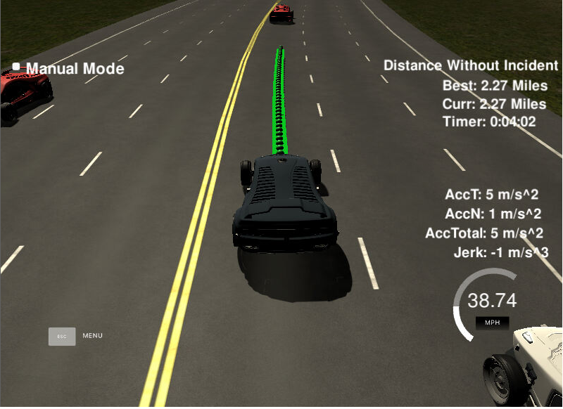
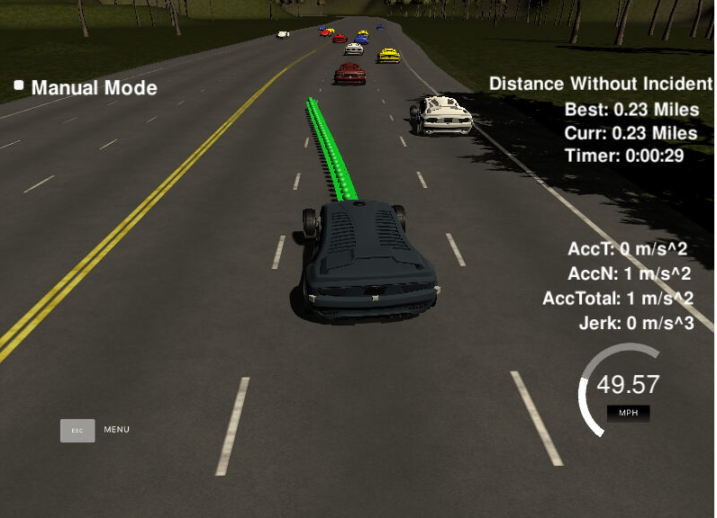

# Path Planning 
---
## Overview

Path-planning is an important primitive for autonomous vehicle that lets autonomous vehicle find the shortest – or otherwise optimal – path between two location. Otherwise optimal paths could be paths that minimize the amount of turning, the amount of braking or whatever a specific application requires.

Aim of this project is to design path planner that is able to create smooth, safe paths for the car to follow along a 3 lane highway with traffic. Autonomous vehicle must meet the constraints such as maximum velocity, maximum acceleration and it must not have a collision situation with other vehicles in the highway. In addition to this, autonomous vehicle should perform lane change to maintain its speed that close to maximum allowable speed.

### Simulator.

Simulator can be downloaded [here](https://github.com/udacity/self-driving-car-sim/releases/tag/T3_v1.2)

To run the simulator on Mac/Linux, first make the binary file executable with the following command:

```shell
sudo chmod u+x {simulator_file_name}
```

## Basic Build Instructions

1. Clone this repo.
2. Make a build directory: `mkdir build && cd build`
3. Compile: `cmake .. && make`
4. Run it: `./path_planning`.

## Dependencies

* cmake >= 3.5
* make >= 4.1
* gcc/g++ >= 5.4
* [uWebSockets](https://github.com/uWebSockets/uWebSockets)

## Project Explanation

Data provided from the Simulator to the C++ Program can be seen as following:

#### The map of the highway is in data/highway_map.txt

There is a list that contains  [x,y,s,dx,dy] values. 

* x and y -> waypoint's map coordinate position,
* s -> distance along the road to get to that waypoint in meters,
* dx and dy -> unit normal vector pointing outward of the highway loop.

The highway's waypoints loop around so the frenet s value, distance along the road, goes from 0 to 6945.554.

#### Main car's localization Data (No Noise)

| **Input** | Definition |
|:---------:|:---------:|
| x | x position of autonomous car in map coordinates |
| y | y position of autonomous car in map coordinates |
| s | s position of autonomous car in frenet coordinates |
| d | d position of autonomous car in frenet coordinates |
| yaw | yaw angle of autonomous car in the map |
| speed | speed of autonomous car in MPH|

#### Previous path data given to the Planner

| **Input** | Definition |
|:---------:|:---------:|
| previous_path_x | Previous list of x points previously given to the simulator |
| previous_path_y | Previous list of y points previously given to the simulator |

#### Previous path's end s and d values 

| **Input** | Definition |
|:---------:|:---------:|
| end_path_s | Previous list's last point's frenet s value |
| end_path_d | Previous list's last point's frenet d value |

#### Sensor Fusion Data, a list of all other car's attributes on the same side of the road.

Sensor fusion -> A 2d vector of cars. It includes:

* car's unique ID, 
* car's x position in map coordinates, 
* car's y position in map coordinates, 
* car's x velocity in m/s, 
* car's y velocity in m/s, 
* car's s position in frenet coordinates, 
* car's d position in frenet coordinates.

## Details

First of all, autonomous car is visiting every `(x,y)` point  (in meters) using controller in the list in every `.02 seconds`. 
* Speed of the autonomous car -> determined by spacing of points.
* Angle of autonomous car -> vector going from a point to next point in the list.
* Tangential and normal acceleration -> measured along with jerk & rate of change of total acc.
* Maximum total acceleration ->`10 m/s^2`, 
* Maximum jerk -> `50 m/s^3`.

## Project Instructions

* **Compilation**

Code that I give compile without errors with `cmake` and `make`.
It is ready to generate the path_panning binary code that will be excutable with no error.

* **Valid Trajectories**

I have present two screenshots of my running simulation.

1. How the car is driving in a lane.



2. Autonomous car is performing lane change with maximum speed while it meets constraints.



It is important to say that algorithm that I built has driven the car in the simulator for more than 1.5 lap with no constraint violation. 

Criteria that I gave as follows:

* Speed limit -> Autonomous car drives within speed limit.
* Max Acceleration and Jerk -> They are not exceeded
* Collision -> There is no collisions.
* Lane keeping -> Autonomous car drives as keeping its current lane until it finds an opportunity to make lane change and reach higher speed.
* Lane change -> Autonomous car is able to perform lane change.

* **Reflection**

Algorithm is mainly written in src/main.cpp. Prediction, behavior planning and trajectory generation are available in code.

1. ##### Prediction

In order to decided whether a car is ahead, to the right or left of the ego vehicle, prediction function deals with the telemetry and sensor fusion data.

2. ##### Behavior Planning

There are 2 following decisions as behevior planning in this project when a car is in front of the ego car:

* Lane change.
* Speed up or speed down.

Depends on data taken from prediction step, speed is increased or decreased and autonomous car performs lane change in behaviour planning step.

3. ##### Trajectory generation

In this part of code, trajectory is calculated considering speed and lane output taken from behaviour planning, past path points and car coordinates. It can be noted that past trajectory points are copied to new trajectory so that continuity on trajectory is provided properly. In every trajectory points (not complete trajectory), speed is increased or decreased. Also, points are calculated by evaluating spline.